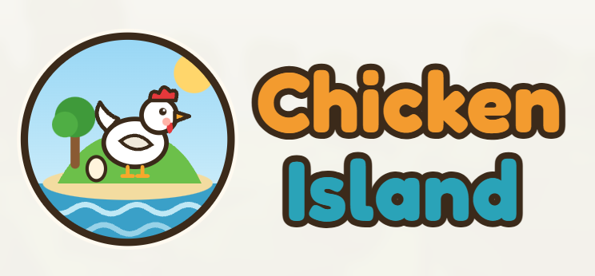
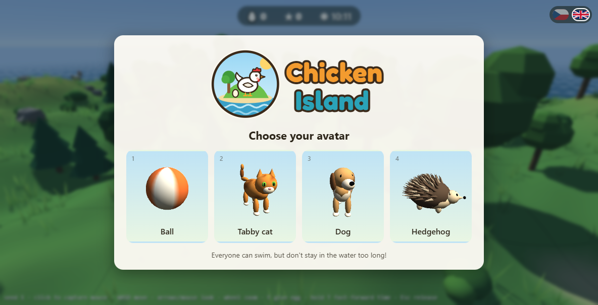
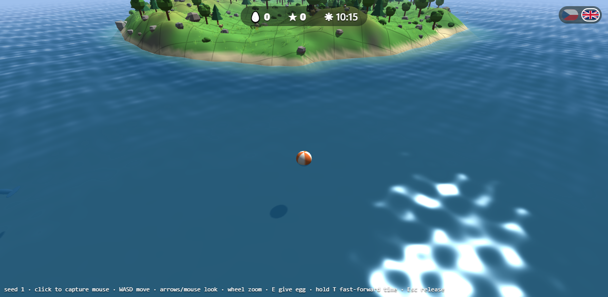
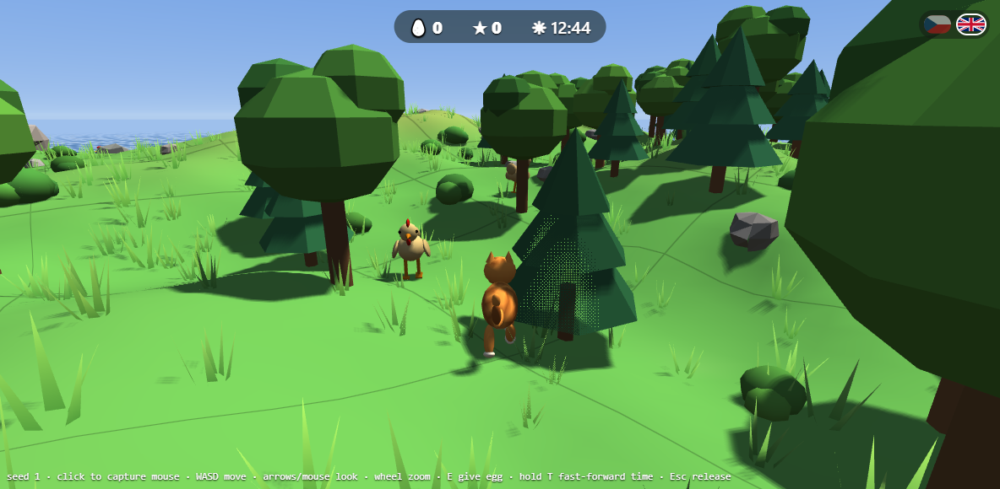
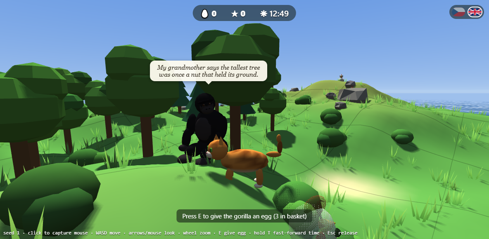
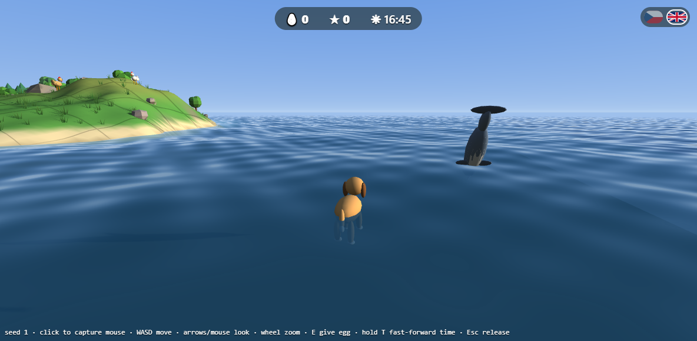
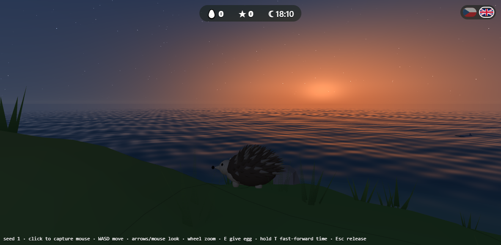
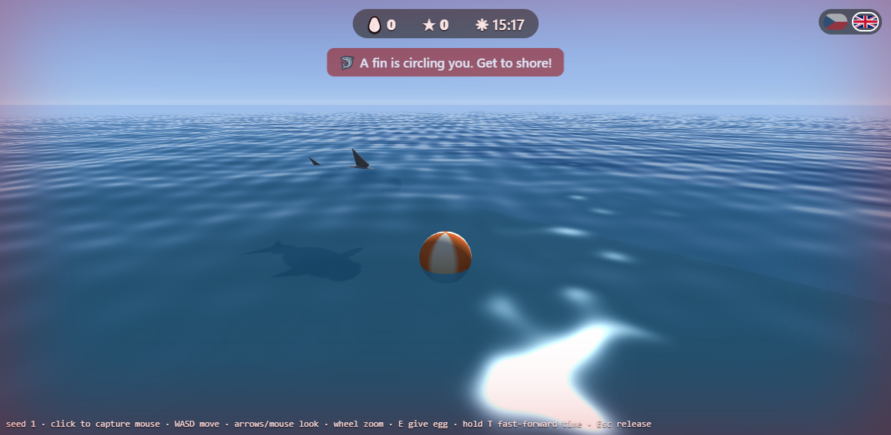

<h1 align="center"></h1>

**Chicken Island** is a small, cozy 3D browser game on a procedurally generated island. Pick an
avatar, roll or wander among the hills and trees, collect the eggs the chickens
lay, share them with a wise young gorilla, swim with the dolphins, and don't
stay in the water too long. There is a shark.

The web client is plain JavaScript and raw WebGL2, with no libraries and no
build step. A small Python (Flask) backend generates the world.



| | |
|---|---|
|  |  |
|  |  |
|  |  |

## Features

- **An island for every seed.** Python generates the hills, beaches and seabed
  from noise, then places forests, rocks, bushes and grass according to height
  and slope. The same seed always gives the same island.
- **Four avatars:** a rolling beach ball, a tabby cat, a dog and a hedgehog. The
  animals walk, idle (they breathe, look around and move their tails) and
  paddle when swimming.
- **Chickens** wander, peck, run from you and lay eggs, brown or cream.
  Collecting an egg is worth 10 points.
- **A wise young gorilla** sits under the biggest tree. Give her eggs (E) and she
  thanks you or shares some forest wisdom. Give her three in quick succession
  and she dances.
- **The sea:** waves, see-through water that is clearer in the shallows, foam on
  the beaches, and sun and moon glints. Every avatar floats. Curious dolphins
  may swim alongside you and sometimes jump.
- **A great white shark** appears if you float for too long. A fin circles in
  a tightening spiral; get to shore in time or it's game over.
- **Day and night:** a moving sun and moon, soft shadows, sunsets, and stars.
- **Things that block the camera turn see-through**, so you never lose sight of
  your avatar behind a tree.
- **English and Czech**, switched with the flags in the top-right corner.
- **Desktop and mobile controls**, including an on-screen joystick for touch.

## Running it

You need Python 3.10+.

```sh
pip install -r requirements.txt
python app.py
```

Then open <http://127.0.0.1:5000>.

URL options:

| Option | Example | Effect |
|---|---|---|
| `seed` | `?seed=42` | a different island |
| `time` | `?time=21` | start at 21:00 (the day starts at 08:00 by default) |

## Controls

| Action | Keyboard and mouse | Touch |
|---|---|---|
| Move | W A S D | joystick under your left thumb |
| Look around | arrow keys, or click to capture the mouse | drag with your right thumb |
| Zoom | mouse wheel | pinch |
| Give the gorilla an egg | E | 🥚 button (appears near her) |
| Fast-forward time | hold T | hold ⏩ |
| Release the mouse | Esc | |

A full day lasts 5 minutes. You can float for about 35 seconds before the
shark comes, and time on land lets you recover.

## Tests

```sh
python -m unittest discover -s tests -t .
node --test tests/js/collision.test.mjs tests/js/eggs.test.mjs tests/js/daynight.test.mjs \
  tests/js/gorilla.test.mjs tests/js/i18n.test.mjs tests/js/dolphins.test.mjs \
  tests/js/input.test.mjs tests/js/shark.test.mjs tests/js/avatars.test.mjs
```

The JavaScript tests need Node 20+ and nothing else. They cover the game logic
(collisions, eggs, dolphins, the shark, avatars, the day/night cycle, input and
translations), not the rendering.

## How it's organised

```
app.py              Flask server: serves the client and /api/terrain (cached per seed)
terrain.py          island heightmap from fractal value noise
props.py            where trees, rocks, bushes, grass and the gorilla go
static/index.html   the page and its overlays (start screen, game over, HUD)
static/js/
  main.js           game loop: update, shadow pass, sky, scene, water, UI
  gl.js             shaders (lighting, shadows, fog, see-through occluders) and meshes
  shapes.js         low-poly primitives the models are built from
  terrain.js, water.js, waves.js, sky.js, skycolor.js, shadows.js, daynight.js
  scenery.js        trees, rocks, bushes and grass merged into one mesh
  avatars.js        the four avatars: models, walk, idle and swim animation
  chicken.js, eggs.js, gorilla.js, dolphins.js, shark.js
  player.js, input.js, touch.js, collision.js
  i18n.js, langswitch.js, preview.js (live avatar previews)
tests/              Python unittest and Node test suites
media/              screenshots
```
